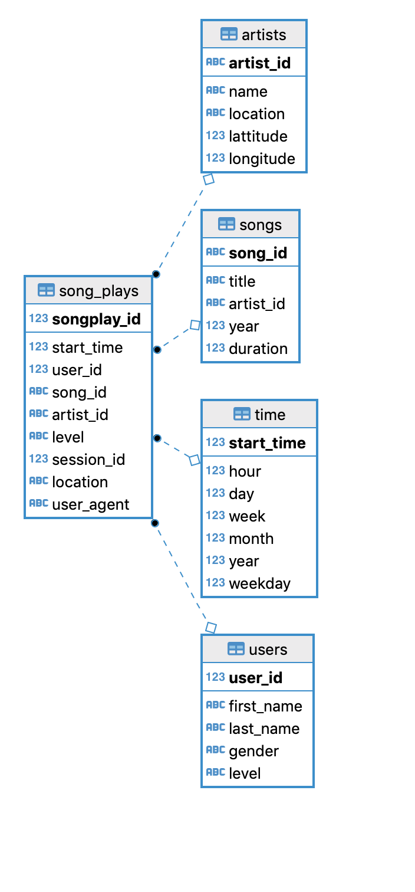
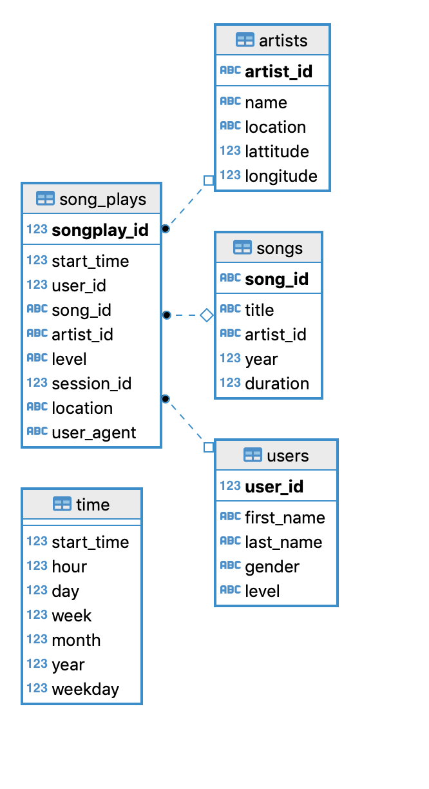

## DEND - Project 2

For query 2 I've used the same table `sessions` as I used for query 1. 

I Assumed that for each session ID there is only one user ID and also knowing 
that clustering keys are sorted in ascending order by default I simply needed to 
filter by session ID instead of filtering by session ID and item in session as suggested.

## DEND - Project 1

### Discussion

#### On `time` table

Yes that's it, there can be duplicated `timestamps` for `song_plays`. Two different users
can be listening musice at the same start time, hence after removing the primary key for 
`time.start_time` and also removing the reference to it on `song_plays` table the 
diagram for the star schema changed a tad.

##### before removing PK

##### after removing PK

#### There are no songplays

TODO Need to elaborate on this one

### On `song_plays` table

`etl.py` from 6820 records has all (`song_id`, `artist_id`) equal to `NULL`, that means that there is no match between `data/song files` and the log files.
